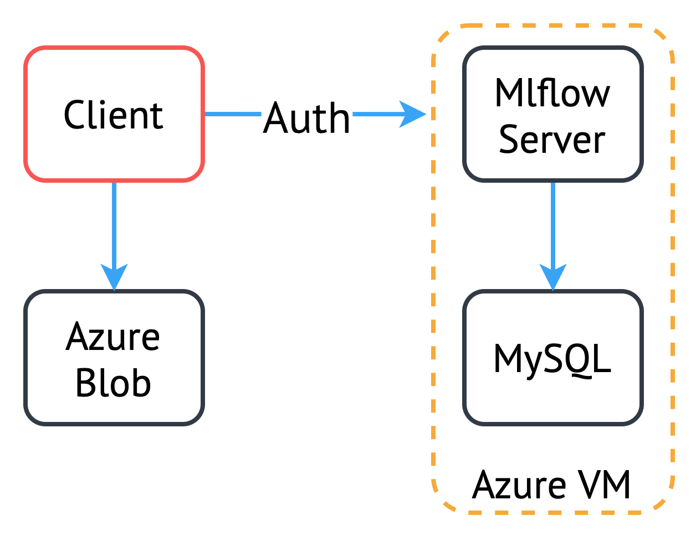
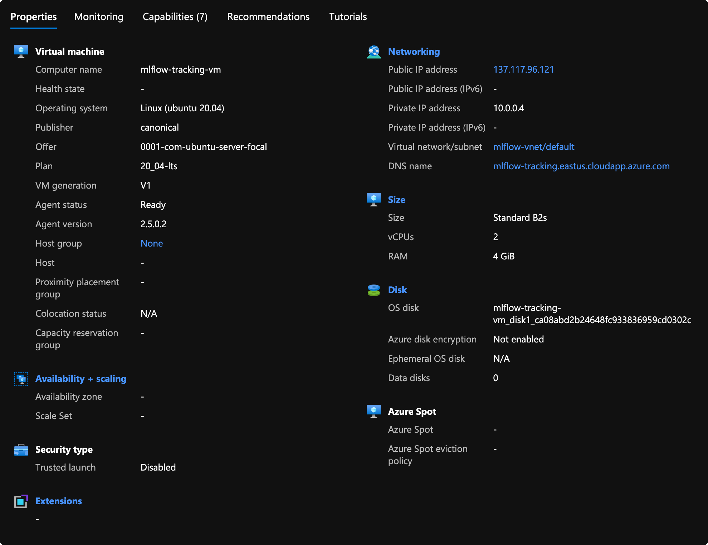
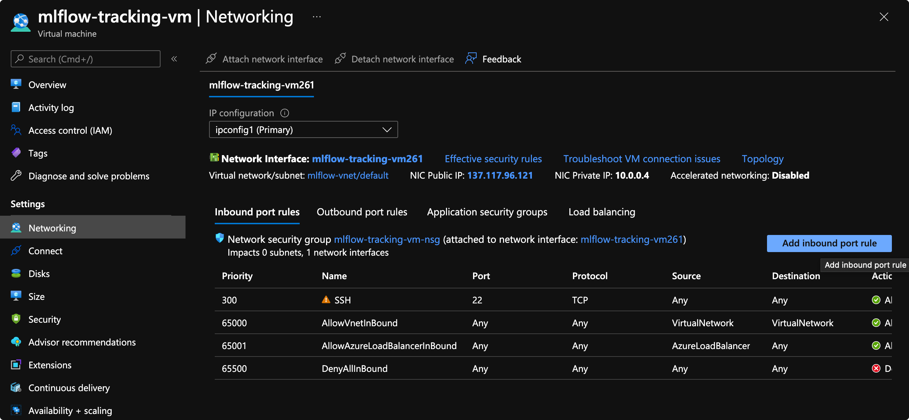
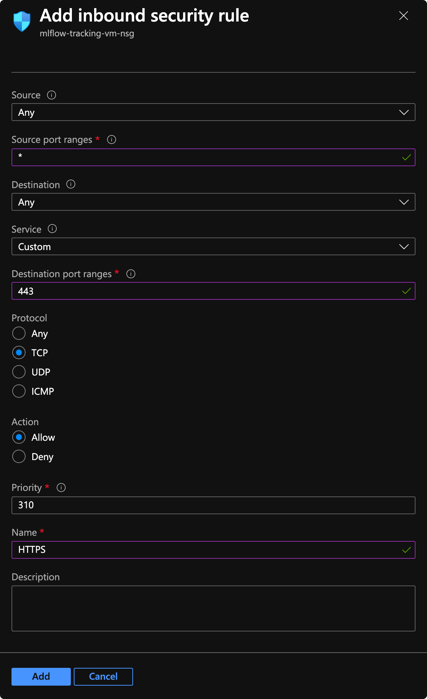
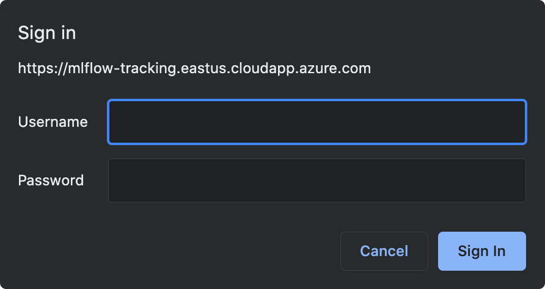

# Getting started with MLflow on Azure

In this blog post we aim to introduce MLflow, deploy on Azure using docker-compose, and run a simple instrumented example model.

## Architecture

A typical MLflow deployment consists of the tracking server, a backend store to maintain results, and an artifact store that will contain larger objects from the end of the run.

* **Backend store**: will often be a database of some kind, so long as the URL can be provided as an [SQLAlchemy database URL](https://docs.sqlalchemy.org/en/14/core/engines.html#database-urls)
* **Artifact store**: contains larger objects and supports many cloud provider solutions (Amazon S3, Azure Blob, ...) as well as alternate remote storage solutions (FTP, NFS, HDFS, ...)


> _**NOTE**_: In this tutorial we will deploy the MySQL database on the same VM as the tracking server, however in production environments it may be beneficial to deploy the database in a more scalable fashion.

<p align="center">
    
</p>

## Deployment

> _**NOTE**_: These deployment steps were accurate at the time of writing, but some installation steps for dependencies may have changed. Please refer to respective websites for up to date installation instructions.

The focus of this section is to deploy the MLflow tracking server to a virtual machine running in Azure, leveraging a MySQL database as the backend store, and Azure blob storage as the artifact store. We also secure the tracking server with basic-auth using Traefik, providing SSL certificates to encrypt communication.

To simplify the deployment process some helper scripts have been provided at [adam-cattermole/mlflow-docker-azure](https://github.com/adam-cattermole/mlflow-docker-azure).

### Create VM

Firstly we must deploy a VM that our tracking server and MySQL database will run on. In this example we will use a relatively lightweight VM that is expected to have high uptime with few concurrent users. We therefore selected a Standard B2s (2 vcpus, 4 GiB memory) VM running Ubuntu 20.04, however this should be chosen as appropriate for your use case.

It is useful to configure the VM with a custom DNS name. It may be necessary to shutdown the VM and detach the network interface temporarily to configure this. In our example we have configured the DNS name as `mlflow-tracking.eastus.cloudapp.azure.com`.

<p align="center">
    
</p>

### Configure Environment

For the deployment of various components by the helper scripts, we must set a series of environment variables.

First we must clone the repository:

```bash
git clone https://github.com/adam-cattermole/mlflow-docker-azure.git
cd mlflow-docker-azure
```

The [configure-env.sh](https://github.com/adam-cattermole/mlflow-docker-azure/blob/main/configure-env.sh#L3-L18) file provides a set of variables at the top of the file which must be populated. Example values are provided below. Note that the `AZURE_STORAGE_ACCESS_KEY` is left blank as we set this once the storage account has been created:

```bash
### Set these variables to be written to .bashrc/stdout

# MYSQL
MYSQL_USER="root"
MYSQL_PASSWORD="root"

# MLFLOW
MLFLOW_TRACKING_USERNAME="admin"
MLFLOW_TRACKING_HOSTNAME="mlflow-tracking.eastus.cloudapp.azure.com"

# AZURE
AZURE_STORAGE_ACCESS_KEY=""
AZURE_STORAGE_ACCOUNT="mlflowacc"
AZURE_STORAGE_CONTAINER="mlflow"
AZURE_RESOURCE_GROUP="mlflow-rg"
AZURE_RESOURCE_GROUP_LOCATION="eastus"
```

Once we have made the changes to this file, we can `echo` the variables to the prompt using:

```bash
./configure-env.sh list <password>
```

Or export them directly to `~/.bashrc`:

```bash
./configure-env.sh write <password>
```

The value provided for `<password>` is used to log in to the tracking server.

> _**NOTE**_: Due to a bug in MLflow, the `password` cannot contain symbols when using Mlflow with Docker (as described in a future section) as the `password` string is not surrounded in quotes when passed to the container. Unfortunately the [relevant bug](https://github.com/mlflow/mlflow/issues/3381) (and [provided fix](https://github.com/harupy/mlflow/commit/a4f23cfb280477528d9de0a2f1d141ad25687b9d)) never made it into a release.

Once these have been added to the shell, we can enable these changes by logging out and in again, or by running:

```bash
source ~/.bashrc
```

### Create Blob Storage

Now that the environment variables have been set, we can create the storage account. This can be performed manually, but we will use the helper script provided.

We must first install the [Azure Command Line Interface](https://docs.microsoft.com/en-us/cli/azure/install-azure-cli). At the time of writing this could be done using the following single command:

```bash
curl -sL https://aka.ms/InstallAzureCLIDeb | sudo bash
```

Once installed we can login:

```bash
az login
```

We can deploy the required resources using:

```bash
./create-azure-sa.sh create_sa
```

This command will write out the `AZURE_STORAGE_ACCESS_KEY` export command to add to your environment. It is also possible to retrieve this later by either re-running the command above, or through the azure portal. The command will only create the resources when it does not find them present with the same name. It is worth updating the `AZURE_STORAGE_ACCESS_KEY` environment variable in your shell configuration `~/.bashrc` and reloading.

```bash
source ~/.bashrc
```

### Set Environment on tracking VM

Some of the configured environment variables are required on the remote tracking VM. To export the same variables to the VM:

```bash
./configure-env.sh list <password> | ssh azureuser@mlflow-tracking.eastus.cloudapp.azure.com "cat >> ~/.bashrc" -->
```

Add the value of `AZURE_STORAGE_ACCESS_KEY` also:

```bash
echo "export AZURE_STORAGE_ACCESS_KEY=<value>" | ssh azureuser@mlflow-tracking.eastus.cloudapp.azure.com "cat >> ~/.bashrc"
```

### Install Dependencies

The deployment scripts rely on Docker and Docker Compose and so these must also be installed and configured on the tracking VM. SSH into the virtual machine now to run through the following steps.

#### Install Docker

Most configuration is now complete, and so we must install Docker. The following is an excerpt of the commands used. Up to date installation instructions can be found [here](https://docs.docker.com/engine/install/ubuntu/).

> ##### Set up the repository
> 1. Update the apt package index and install packages to allow apt to use a repository over HTTPS:
> ```bash
> sudo apt-get update
> sudo apt-get install \
>    apt-transport-https \
>    ca-certificates \
>    curl \
>    gnupg \
>    lsb-release
>```
> 2. Add Docker’s official GPG key:
>```bash
>curl -fsSL https://download.docker.com/linux/ubuntu/gpg | sudo gpg --dearmor -o /usr/share/keyrings/docker-archive-keyring.gpg
>```
> 3. Use the following command to set up the stable repository. To add the nightly or test repository, add the word nightly or test (or both) after the word stable in the commands below. Learn about nightly and test channels.
>```bash
> echo \
>  "deb [arch=amd64 signed-by=/usr/share/keyrings/docker-archive-keyring.gpg] https://download.docker.com/linux/ubuntu \
>  $(lsb_release -cs) stable" | sudo tee /etc/apt/sources.list.d/docker.list > /dev/null
>```
> ##### Install Docker Engine
> 1. Update the apt package index, and install the latest version of Docker Engine and containerd, or go to the next step to install a specific version:
> ```bash
> sudo apt-get update
> sudo apt-get install docker-ce docker-ce-cli containerd.io
> ```
> ##### Manage Docker as a non-root user
> 1. Create the docker group.
> ```bash
> sudo groupadd docker
> ```
> 2. Add your user to the docker group.
> ```bash
>  sudo usermod -aG docker $USER
> ```
> 3. Log out and log back in so that your group membership is re-evaluated. </br>
> ...</br>
> On Linux, you can also run the following command to activate the changes to groups:
> ```bash
>  newgrp docker 
> ```

#### Install Docker Compose

Up to date instructions can be found [here](https://docs.docker.com/compose/install/). The following commands were accurate at the time of writing.

> Run this command to download the current stable release of Docker Compose:
>
> ```bash
> sudo curl -L "https://github.com/docker/compose/releases/download/1.29.2/docker-compose-$(uname -s)-$(uname -m)" -o /usr/local/bin/docker-compose
> ```
> To install a different version of Compose, substitute 1.29.2 with the version of Compose you want to use.
>
> If you have problems installing with curl, see Alternative Install Options tab above.
>
> Apply executable permissions to the binary:
>
>```bash
> sudo chmod +x /usr/local/bin/docker-compose
> ```
<!-- > Note: If the command docker-compose fails after installation, check your path. You can also create a symbolic link to /usr/bin or any other directory in your path.
>
> For example:
>
> ```bash
> sudo ln -s /usr/local/bin/docker-compose /usr/bin/docker-compose
> ``` -->

### Run the Server

Once we have docker running and all of the required environment variables in the shell, we can test deploying the resources. All of the required configuration is provided within the [docker-compose.yaml](https://github.com/adam-cattermole/mlflow-docker-azure/blob/main/docker-compose.yml) file, extracting the values set in the environment.

Clone the repository again (this time on the remote):

```bash
git clone https://github.com/adam-cattermole/mlflow-docker-azure.git
cd mlflow-docker-azure
```

Simply run:

```bash
docker-compose up --build
```

This:

* Creates the MySQL container with a default database named 'mlflow'
* Starts a traefik container to route connections, creating the required certificates for the DNS name provided
* Launches the tracking server communicating with the local MySQL instance as well as the remote artifact store

### Expose the server

We need to expose the VM on port `443` so that we can access it via `HTTPS`. This can easily be done through the azure portal, navigating through: VM -> Networking -> Inbound port rules -> Add inbound port rule.

<p align="center">
    
</p>

Create the rule exposing TCP for port `443` as required:

<p align="center">
  
</p>


Once this route has been exposed, you should be able to access the dashboard through the DNS name configured. In our case the DNS name was configured as `mlflow-tracking.eastus.cloudapp.azure.com`, and so we can access the dashboard at:

https://mlflow-tracking.eastus.cloudapp.azure.com

You will hit a login prompt:

<p align="center">
  
</p>

The login credentials are the values you set using `configure-env.sh` - `MLFLOW_TRACKING_USERNAME` and `MLFLOW_TRACKING_PASSWORD`.

## Running our first Model

We will run through the steps to run a simple model, tracking metrics and artifacts to the mlflow tracking server.


### Simple example

The mlflow website provides [a simple example](https://github.com/mlflow/mlflow/blob/master/examples/sklearn_elasticnet_wine/train.py) that demonstrates the logging of parameters and metrics with `log_param` and `log_metric` respectively, but also the storage of artifacts using `log_model`. You can clone the mlflow repository to gain access to this model:

```bash
git clone https://github.com/mlflow/mlflow.git
cd mlflow/examples/sklearn_elasticnet_wine/
```

```python
# The data set used in this example is from http://archive.ics.uci.edu/ml/datasets/Wine+Quality
# P. Cortez, A. Cerdeira, F. Almeida, T. Matos and J. Reis.
# Modeling wine preferences by data mining from physicochemical properties. In Decision Support Systems, Elsevier, 47(4):547-553, 2009.

import os
import warnings
import sys

import pandas as pd
import numpy as np
from sklearn.metrics import mean_squared_error, mean_absolute_error, r2_score
from sklearn.model_selection import train_test_split
from sklearn.linear_model import ElasticNet
from urllib.parse import urlparse
import mlflow
import mlflow.sklearn

import logging

logging.basicConfig(level=logging.WARN)
logger = logging.getLogger(__name__)


def eval_metrics(actual, pred):
    rmse = np.sqrt(mean_squared_error(actual, pred))
    mae = mean_absolute_error(actual, pred)
    r2 = r2_score(actual, pred)
    return rmse, mae, r2


if __name__ == "__main__":
    warnings.filterwarnings("ignore")
    np.random.seed(40)

    # Read the wine-quality csv file from the URL
    csv_url = (
        "http://archive.ics.uci.edu/ml/machine-learning-databases/wine-quality/winequality-red.csv"
    )
    try:
        data = pd.read_csv(csv_url, sep=";")
    except Exception as e:
        logger.exception(
            "Unable to download training & test CSV, check your internet connection. Error: %s", e
        )

    # Split the data into training and test sets. (0.75, 0.25) split.
    train, test = train_test_split(data)

    # The predicted column is "quality" which is a scalar from [3, 9]
    train_x = train.drop(["quality"], axis=1)
    test_x = test.drop(["quality"], axis=1)
    train_y = train[["quality"]]
    test_y = test[["quality"]]

    alpha = float(sys.argv[1]) if len(sys.argv) > 1 else 0.5
    l1_ratio = float(sys.argv[2]) if len(sys.argv) > 2 else 0.5

    with mlflow.start_run():
        lr = ElasticNet(alpha=alpha, l1_ratio=l1_ratio, random_state=42)
        lr.fit(train_x, train_y)

        predicted_qualities = lr.predict(test_x)

        (rmse, mae, r2) = eval_metrics(test_y, predicted_qualities)

        print("Elasticnet model (alpha=%f, l1_ratio=%f):" % (alpha, l1_ratio))
        print("  RMSE: %s" % rmse)
        print("  MAE: %s" % mae)
        print("  R2: %s" % r2)

        mlflow.log_param("alpha", alpha)
        mlflow.log_param("l1_ratio", l1_ratio)
        mlflow.log_metric("rmse", rmse)
        mlflow.log_metric("r2", r2)
        mlflow.log_metric("mae", mae)

        tracking_url_type_store = urlparse(mlflow.get_tracking_uri()).scheme

        # Model registry does not work with file store
        if tracking_url_type_store != "file":

            # Register the model
            # There are other ways to use the Model Registry, which depends on the use case,
            # please refer to the doc for more information:
            # https://mlflow.org/docs/latest/model-registry.html#api-workflow
            mlflow.sklearn.log_model(lr, "model", registered_model_name="ElasticnetWineModel")
        else:
            mlflow.sklearn.log_model(lr, "model")
```

### Dependencies on the running machine

In our use cases we found that the machine that we run the models from is not the same machine that the mlflow tracking server is running on. A set of dependencies must be configured to permit smooth running of the application.

Note that whilst the mlflow run data is stored remotely in the tracking server, the execution of the model is performed on the local calling machine, wrapped by requests to the tracking server as well as direct interaction with the artifact store. In some cases it may be beneficial to deploy the code to a remote server, especially when leveraging a GPU-enabled machine. This is discussed further in the section on Docker below.

<!-- #### Environment Variables

To ensure that we can communicate with the tracking server we must export a set of the environment variables that we created on the tracking VM. This includes:

```bash
MLFLOW_TRACKING_USERNAME
MLFLOW_TRACKING_PASSWORD
AZURE_STORAGE_ACCESS_KEY
```

We also must set the `MLFLOW_TRACKING_URI` variable to the hostname of our tracking server. We selected the DNS name `mlflow-tracking.eastus.cloudapp.azure.com`, and so the variables would look similar to below, replacing both `<password>` and `<access-key>` with the values retrieved from `configure-env.sh`:

```bash
MLFLOW_TRACKING_URI="https://mlflow-tracking.eastus.cloudapp.azure.com"
MLFLOW_TRACKING_USERNAME="admin"
MLFLOW_TRACKING_PASSWORD="<password>"
AZURE_STORAGE_ACCESS_KEY="<access-key>"
``` -->

#### Install dependencies

By default, the running machine is where the mlflow model is deployed, and so Python is required along with a set of packages. This example relies on `scikit-learn`. `azure-storage-blob` is also required as the running machine connects directly with the artifact store to log the model.

Assuming the currently active python environment is the one in which you would like to deploy your model:

```bash
pip install mlflow scikit-learn azure-storage-blob
```

#### Running the model

At this point we can run the model by running the script in python. Assuming we are in the `examples/sklearn_elasticnet_wine/` directory, running the following command to train with default parameters:

```bash
python train.py
```

Or to specify the values of `<alpha>` and `<l1_ratio>`:

```
python train.py <alpha> <l1_ratio>
```

#### Configure Project

To set up a project in mlflow we need to create the MLproject file. This can be used to define starting parameters and entrypoints for the different experiments within your project, alongside an environment to run within. The simple MLproject example below is provided in the `examples/sklearn_elasticnet_wine/` directory, where a conda environment is specified.

```yaml
name: tutorial

conda_env: conda.yaml

entry_points:
  main:
    parameters:
      alpha: {type: float, default: 0.5}
      l1_ratio: {type: float, default: 0.1}
    command: "python train.py {alpha} {l1_ratio}"
```

The `conda.yml` file consists of the specification for dependencies:

```yaml
name: tutorial
channels:
  - conda-forge
dependencies:
  - python=3.6
  - pip
  - pip:
    - scikit-learn==0.23.2
    - mlflow>=1.0
    - pandas

```

To run the model with the default parameters:

```bash
mlflow run .
```

Or to specifiy the parameters:

```bash
mlflow run . -P alpha=<alpha> -P l1_ratio=<l1_ratio>
```

As our example only consists of a single experiment it is defined as the `main` entrypoint, and is the default. However it is possible to define a different entrypoint for an alternate experiment, lets say for a file defined as `train_new.py` and call this explicitly:

```yaml
name: tutorial

conda_env: conda.yaml

entry_points:
  main:
    parameters:
      alpha: {type: float, default: 0.5}
      l1_ratio: {type: float, default: 0.1}
    command: "python train.py {alpha} {l1_ratio}"
  train_new:
      alpha: {type: float, default: 0.5}
      l1_ratio: {type: float, default: 0.1}
    command: "python train_new.py {alpha} {l1_ratio}"
```

```bash
mlflow run . -e train_new -P alpha=<alpha> -P l1_ratio=<l1_ratio>
```


### Using Docker for Remote Model Deployment

When using mlflow we decided it would be useful to deploy our models to a remote machine, especially in the case where the model relies on GPU's to perform well. In this case we leverage Docker, with a remote machine using a GPU.

First off we must deploy a VM in Azure, setting an appropriate DNS name. We selected `mlflow-training.eastus.cloudapp.azure.com` for the training VM with a GPU and deployed it with the [Azure Data Science Virtual Machine image](https://azure.microsoft.com/en-gb/services/virtual-machines/data-science-virtual-machines/#product-overview) (DSVM). Docker must also be installed in the same way as for the training VM - follow the steps above (docker-compose is NOT needed however).

We can then configure our local machine to use this VM for all Docker commands by setting the `DOCKER_HOST` environment variable. The calling machine must have SSH access to the VM. The only prequisite is to install the `paramiko` python package (and Docker must be callable from the local machine):

```bash
pip install paramiko
```

Set the environment variable:

```bash
export DOCKER_HOST="ssh://azureuser@mlflow-training.eastus.cloudapp.azure.com
```

#### Creating a Dockerfile

To deploy to our model to the GPU-enabled VM, we must first create a docker container. To do this we must leverage CUDA - we used the same version of CUDA that was included in the DSVM on our VM (11.1.1). We also matched the cudNN package to the version we had installed from the DSVM. The resulting Dockerfile looked similar to below:

```Dockerfile
FROM nvidia/cuda:11.1.1-cudnn8-runtime-ubuntu20.04

RUN apt-get update && apt-get install -y \
    python3 \
    python3-dev \
    python3-pip \
    python3-distutils \
    && apt-get install -y --allow-change-held-packages libcudnn8=8.1.0.77-1+cuda11.2 \
    && rm -rf /var/lib/apt/lists/*

RUN update-alternatives --install /usr/bin/python python /usr/bin/python3 1

COPY train.py ./

RUN pip install \
    mlflow \
    scikit-learn \
    azure-storage-blob
```

We can now build the docker image from this file:

```bash
docker build -t train:latest .
```

This will have built the image on our remote VM!

#### Updating the Configuration

We must update our MLproject file to specify some docker environment options instead of the conda environment used prior. We point mlflow to our docker image named 'train'. We also provide the `docker_env.environment` option, telling mlflow to copy the values of `MLFLOW_TRACKING_USERNAME` and `MLFLOW_TRACKING_PASSWORD` into the Docker container.

```yaml
name: tutorial

docker_env:
  image: train
  environment: ["MLFLOW_TRACKING_USERNAME", "MLFLOW_TRACKING_PASSWORD"]

entry_points:
  main:
    parameters:
      alpha: {type: float, default: 0.5}
      l1_ratio: {type: float, default: 0.1}
    command: "python train.py {alpha} {l1_ratio}"
```

Mlflow directly calls docker when specified with a `docker_env`. As we have set `DOCKER_HOST`, the execution will take place on the remote machine. We can therefore run the default experiment with the following command (the `-A gpus=all` ensures the GPU's are passed through to the Docker container):

```bash
mlflow run . -A gpus=all
```
